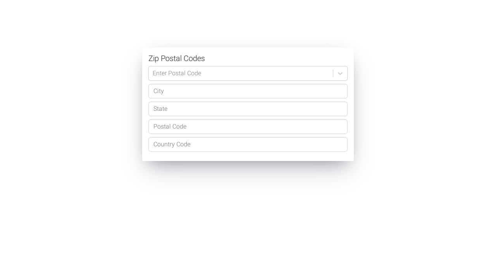

# React Zip
### [Live Site on Heroku](https://serdarsen-react-zip.herokuapp.com/)

## Introduction
React Zip is a demo app displaying zip postal codes.

### Feature
- Ability to explore zip postal codes.
- Built with Webpack.

## Usage
run `npm run start`, browse `localhost:5000`

## Reference
- [Bootstrap](https://getbootstrap.com/)
- [Webpack](https://webpack.js.org/)
- [Heroku](https://devcenter.heroku.com/categories/deployment)
- [ESLint](https://eslint.org/)
- [Zipcodebase](https://zipcodebase.com/)